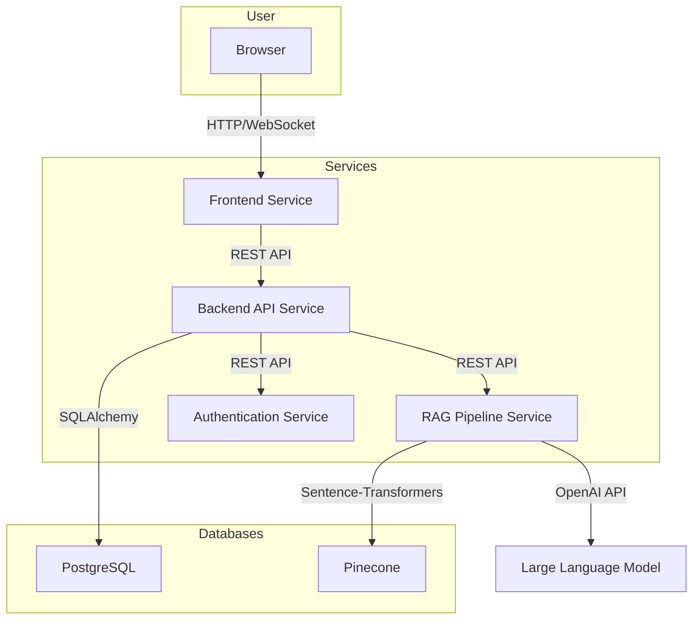

# Architecture Overview

This document provides a high-level overview of the system architecture for the Intelligent Documentation Assistant.

## System Components

The system is designed as a microservices-based architecture to ensure modularity, scalability, and maintainability. The main components are:

1.  **Frontend Service**: A React-based single-page application that provides the user interface for the documentation assistant.
2.  **Backend API Service**: A FastAPI-based service that handles user authentication, business logic, and communication with other services.
3.  **RAG Pipeline Service**: A dedicated service that encapsulates the entire Retrieval-Augmented Generation pipeline, from data ingestion to answer generation.
4.  **Authentication Service**: A service responsible for user registration, login, and session management.

## System Diagram

## Request Flow

1.  The user interacts with the **Frontend Service** in their browser.
2.  The **Frontend Service** sends requests to the **Backend API Service**.
3.  For authentication-related requests, the **Backend API Service** communicates with the **Authentication Service**.
4.  For conversational Q&A, the **Backend API Service** communicates with the **RAG Pipeline Service**.
5.  The **RAG Pipeline Service** retrieves relevant context from the **Pinecone** vector database and generates an answer using a large language model.
6.  The **Backend API Service** interacts with the **PostgreSQL** database for data persistence.
